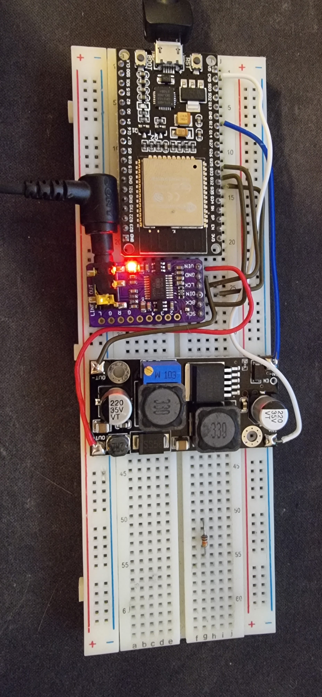
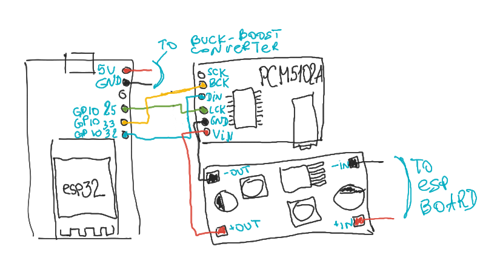

# ESP32-based Bluetooth audio receiver

This is a Bluetooth receiver I use for my car, since it does not support Bluetooth and my phone (like most new models) does not have a 3.5mm jack.

The usage is quite simple: just plug it in your car's 3.5mm audio input (AUX) and power the device with 5V (car phone charger does well).
Then connect your phone to the Bluetooth audio device `ESPeaker_test` and enjoy your music of choice in your car.

## Hardware

The device is quite simple and uses just three pre-built modules you can get anywhere (I prefer AliExpress):
* ESP32 (pretty much any version would do, I used `ESP32 WROOM-32` module)
* `PCM5102A` module (audio DAC featuring I2S protocol)
* a semi-decent buck-boost converter (for stable power supply, I tried a tiny "700ma 5W" module, which failed horribly, so stuck with a big `XL6019` 20W board)

The connection diagram is pretty simple:

Essentially, you only really need to connect 3 pins of PCM5102A module to those pins of ESP32 which can be used for I2S communication:

| ESP32 pin | PCM5102A pin |
| --------- | ------------ |
| `GPIO25`  | `LCK`        |
| `GPIO32`  | `DIN`        |
| `GPIO33`  | `BCK`        |

I used a buck-boost converter to separate the `VCC` and `GND` lines of the microcontroller and the audio module (for noise reduction).

## Software

I build the source and flash the device using Arduino IDE with the ESP32 plugin.
